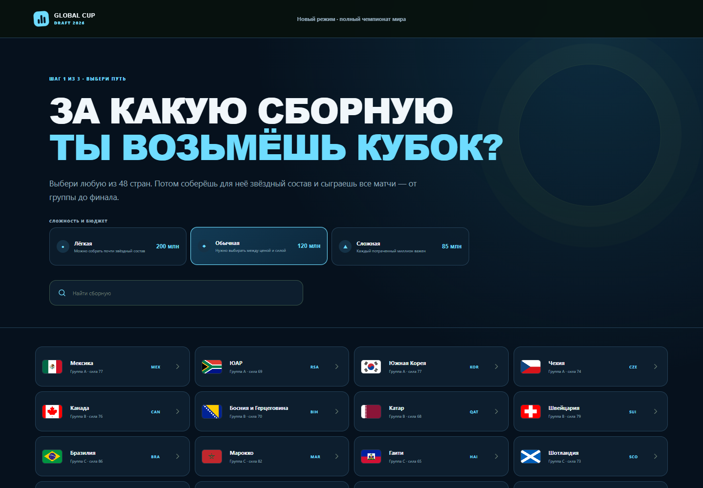
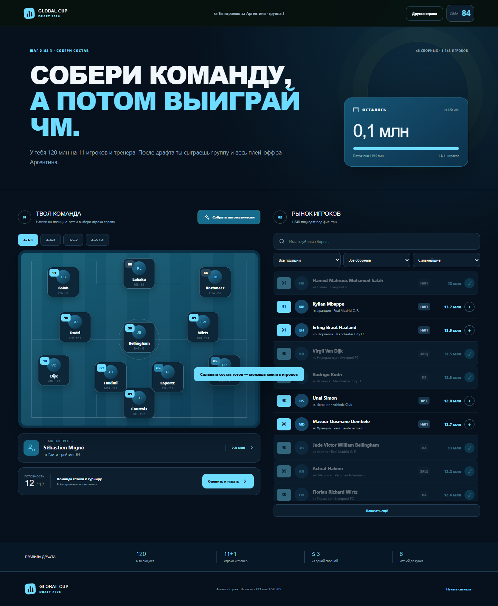
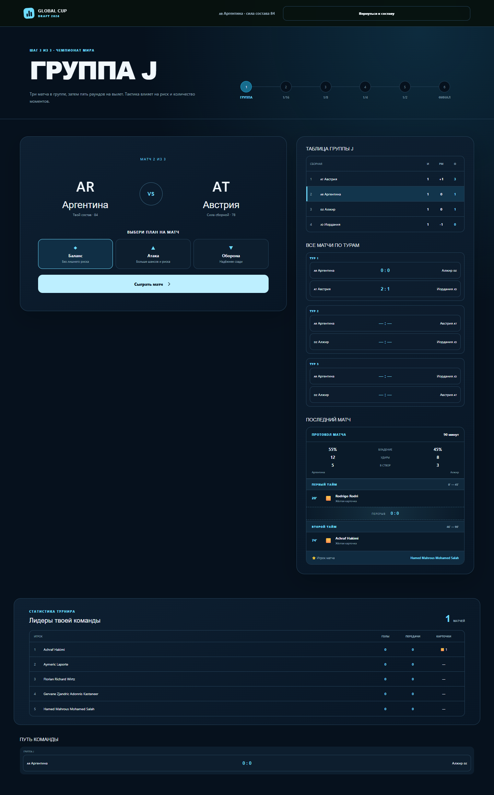
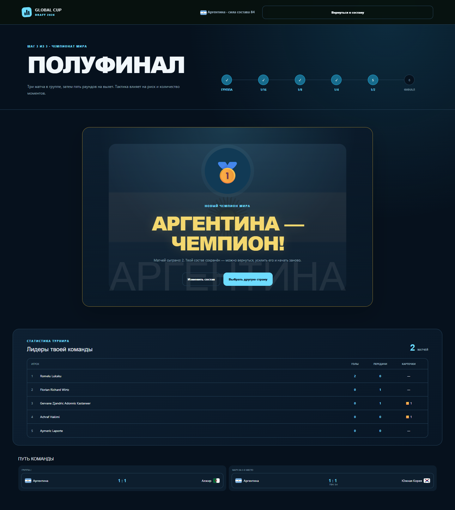

# Global Cup Draft 2026

Браузерная футбольная стратегия: игрок выбирает одну из 48 сборных, собирает состав в пределах бюджета и проходит полный турнир — от группы до финала.

### [Играть онлайн](https://zabavok.github.io/global-cup-draft-2026/) · [Подробный разбор проекта](CASE_STUDY.md)



## Зачем этот проект

Я хотел сделать не обычный список футбольных карточек, а законченную игровую систему, в которой несколько механик работают вместе:

- драфт с ограниченным бюджетом;
- осмысленный выбор между рейтингом и ценой;
- полноценный турнир на 48 сборных;
- понятная симуляция матчей;
- статистика, которая накапливается по ходу прохождения;
- интерфейс, которым удобно пользоваться без инструкции.

## Основные возможности

- 1 248 футболистов и 48 тренеров;
- выбор любой из 48 стран;
- три сложности: 200 млн, 120 млн и 85 млн на 11 игроков и тренера;
- четыре схемы и ограничение до трёх игроков одной сборной;
- поиск, фильтры и сортировка по рейтингу, цене и выгоде;
- автоматическая сборка конкурентного состава;
- 12 групп, синхронные туры и таблицы с очками;
- плей-офф от 1/16 финала до финала;
- заранее сформированная сетка и возможный соперник в следующем раунде;
- три тактики: баланс, атака и оборона;
- протокол матча с владением, ударами, голами, передачами и карточками;
- разделение событий на первый тайм, второй тайм и дополнительное время;
- бомбардиры, ассистенты и дисциплинарная статистика;
- матч за третье место после поражения в полуфинале;
- отдельные золотой, серебряный и бронзовый финальные экраны;
- итоговый пьедестал трёх лучших сборных;
- награды по образцу церемонии FIFA: Golden Ball, Golden Boot, Golden Glove, Young Player и Fair Play;
- сенсация и разочарование турнира;
- флаг выбранной страны на финальном экране и локальные изображения флагов всех сборных;
- автосохранение прохождения в браузере;
- адаптивная вёрстка для компьютера и телефона.

## Как устроен игровой цикл

1. Выбрать сборную.
2. Собрать команду вручную или автоматически.
3. Выбрать тренера и получить рейтинг состава.
4. Сыграть три синхронных тура группового этапа.
5. Выйти в плей-офф и пройти стабильную турнирную сетку.
6. Получить итоговое место, пьедестал, индивидуальные награды и статистику своей команды.







## Техническая часть

- React 19;
- Vite 7;
- чистый CSS без готовой UI-библиотеки;
- детерминированная симуляция параллельных матчей;
- `localStorage` для сохранения игры;
- автоматическая подготовка данных;
- GitHub Actions и GitHub Pages для публикации;
- браузерные проверки критических сценариев.

Основная логика турнира отделена от интерфейса: генерация туров, таблицы, квалификация, сетка и определение победителей находятся в `app/tournament.js`. Интерфейс и пользовательские сценарии собраны в `app/page.jsx`.

## Локальный запуск

Нужен Node.js 20 или новее.

```bash
pnpm install
pnpm dev
```

После запуска открыть адрес, который появится в терминале.

Проверка production-сборки:

```bash
pnpm build
```

## Данные и рейтинги

Базовые составы, тренеры и турнирные данные подготовлены на основе открытого набора [Mominullptr/fifa-world-cup-2026-dataset](https://huggingface.co/datasets/Mominullptr/fifa-world-cup-2026-dataset) под лицензией CC0-1.0. Изображения флагов подготовлены на основе набора [Flagpedia / FlagCDN](https://flagpedia.net/download/api).

Игровые цены и рейтинги дополнительно нормализованы для баланса драфта. Это фанатские оценки, а не официальные рейтинги FIFA или EA SPORTS FC.

## Статус

Проект завершён как самостоятельный портфолио-кейс и опубликован в открытом доступе. Следующий разумный этап — серверный рейтинг игроков и общая таблица результатов.

Проект не связан с FIFA, EA SPORTS или правообладателями турнира и не использует их официальную символику.
